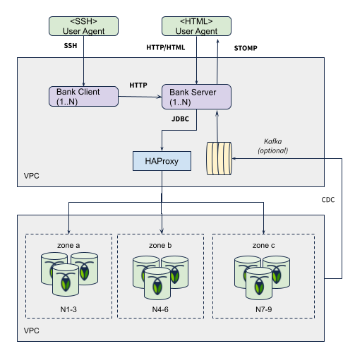

[](https://github.com/kai-niemi/roach-bank/actions/workflows/maven.yml)

# Roach Bank

Roach Bank represents a full-stack, financial accounting ledger demo running on [CockroachDB](https://www.cockroachlabs.com/)
and PostgreSQL. It's designed to demonstrate the safety and liveness properties of a globally deployed, 
system-of-record type of workload.

# Introduction

The concept of the ledger is to move funds between accounts using balanced, multi-legged transactions 
at a high frequency. As a financial system, it needs to conserve money at all times and also provide 
an audit trail of all transactions performed towards the accounts.

This is visualized (below) using a single page to display accounts as rectangles with their current
balance.


## Key Invariants

There are two key invariants that must hold true at all times, regardless of observer and activities 
such as infrastructure failure and conflicting operations if updating the same accounts 
concurrently:

* The total balance of all accounts must be constant
* All user accounts must have a positive balance

The system must deny forward progress if an operation would result in any invariant being compromised. 
For example, if a variation of the total balances is observed at any given time it means these rules 
have been breached and money has either been invented or destroyed. Because it's a stateless service, 
these invariants are safeguarded by the ACID transactional guarantees of the CockroachDB database.

## Double-entry Bookkeeping

For auditability, this ledger follows the [double-entry bookkeeping](https://en.wikipedia.org/wiki/Double-entry_bookkeeping)
principle for monetary transactions. This principle was originally formalized and published by the italian 
mathematician Luca Pacioli during the 15:th century. It involves making at least two account entries for 
every transaction. A debit in one account and a corresponding credit in another account. The sum of all 
debits must equal the sum of all credits, providing a simple method for error detection.

    Account | Credit(+) | Debit(-) |
    A         100               
    B                     -50
    C          25
    D*                    -25 \
                               -75 (coalesced)
    D*                    -50 /
    ------------------------------------------
    Σ         125    +   -125 = 0 

Real accounting doesn't use negative numbers, but for simplicty this ledger does. A positive value means 
increasing value (credit), and a negative value means decreasing value (debit). A transaction is 
considered balanced when the sum of the legs with the same currency equals zero.

# Design and Implementation

See the [Design Notes](docs/DESIGN.md) for a complete overview of used architectural mechanisms.
The ledger is based on a common [Spring Boot](https://spring.io/projects/spring-boot) microservice
stack using Spring Boot, Spring Data JDBC/JPA, Spring Hateoas, HikariCP, Flyway and more. Kafka
is optional to use to drive account balance push events.

Architecture overview:



# Subprojects

- [api](bank-api/README.md) - API artifacts and message models
- [client](bank-client/README.md) - Interactive service endpoint shell client for generating load
- [server](bank-server/README.md) - Main service implementation

# Project Setup

Guide for cloning a building the bank deployment artfiacts.

## Prerequisites

- Java 17
    - https://openjdk.org/projects/jdk/17/
    - https://www.oracle.com/java/technologies/downloads/#java17
- Maven 3+ (optional, embedded wrapper available)
    - https://maven.apache.org/

Install the JDK (Linux):

```bash
sudo apt-get -qq install -y openjdk-17-jdk
```

Install the JDK (macOS):

```bash
brew install openjdk@17 
```

Confirm the installation by running:

```bash
java -version
```

## Maven Configuration

You need to authenticate to GitHub Packages by creating a personal access token (classic)
that includes the `read:packages` scope. For more information, see [Authenticating to GitHub Packages](https://docs.github.com/en/packages/working-with-a-github-packages-registry/working-with-the-apache-maven-registry#authenticating-to-github-packages).

Then add your personal access token to the servers section in your Maven [settings.xml](https://maven.apache.org/settings.html).
Note that the server and repository id's must match but doesnt need to have id `github`.

```xml
<?xml version="1.0" encoding="UTF-8"?>
<settings xmlns="http://maven.apache.org/SETTINGS/1.2.0"
          xmlns:xsi="http://www.w3.org/2001/XMLSchema-instance"
          xsi:schemaLocation="http://maven.apache.org/SETTINGS/1.2.0 https://maven.apache.org/xsd/settings-1.2.0.xsd">
    ...
    <servers>
        <server>
            <id>github</id>
            <username>your-github-name</username>
            <password>your-access-token</password>
        </server>
    </servers>
    ...
</settings>
```

The here are two locations where this file may be placed:

- A user's home dir: `$user.dir/.m2/settings.xml` (default)
- The Maven install dir: `$M2_HOME/conf/settings.xml`

Now you should be able to build the project:

```shell
./mvnw clean install
```

If you get a HTTP 401 error, verify that the access token is valid. 

## Supported Databases

Supported databases are CockroachDB 22.1+ and PostgreSQL 10+. The database type can 
be selected at start-up time by activating the appropriate profile (see `run-server.sh`). 
The creation of table schema and an initial account plan is fully automatic. 

### CockroachDB Notes

CockroachDB with a trial [enterprise license](https://www.cockroachlabs.com/docs/stable/licensing-faqs.html#obtain-a-license)
is required due to the use of features like geo-partitioning and follower-reads.

Create the database:

    cockroach sql --insecure --host=localhost -e "CREATE database roach_bank;"
    
Set an enterprise license (optional):

    cockroach sql --insecure --host=localhost -e "SET CLUSTER SETTING cluster.organization = '...'; SET CLUSTER SETTING enterprise.license = '...';"
 
### PostgreSQL Notes

Create the database:

    CREATE database roach_bank;
    CREATE extension pgcrypto;

## Local Deployment
                   
For starting the server and client on the local machine.

### Server

    chmod +x run-server.sh
    ./run-server.sh

### Client

    chmod +x run-client.sh
    ./run-client.sh

See [server](bank-server/README.md) and [client](bank-client/README.md) for more 
options and details.

## Cloud Deployment 

See the [Deployment Guide](deploy/README.md) on how to deploy the ledger to a single or multi-region
AWS, GCE or Azure cluster. 

## Terms of Use

See [MIT](LICENSE.txt) for terms and conditions.

---
