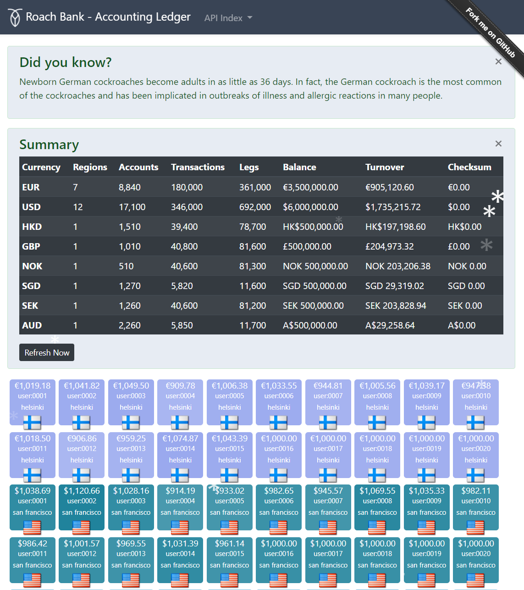
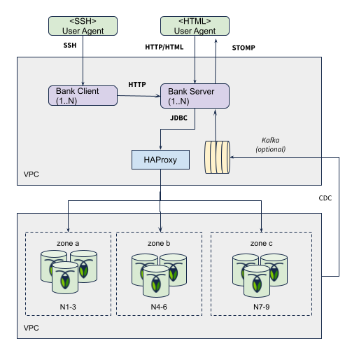

Roach Bank represents a financial ledger demo, designed to demonstrate the safety and liveness 
properties of a full-stack accounting ledger deployed across the globe using 
[CockroachDB](https://www.cockroachlabs.com/). 

# Introduction

Each bank instance provides a single HTML page that displays the top accounts in the system, grouped 
by currency and region (city) represented by colored rectangles. The concept is to concurrently 
transfer funds between thse different accounts by using balanced, multi-legged monetary transactions.

                
# Requirements

As a financial ledger, it needs to conserve money and show an audit trail of all transactions
performed towards accounts. In Roach Bank, there are two key invariants that must hold true
at all times regardless of observer, during failures in infrastructure and concurrent 
conflicting operations (updating same accounts concurrently).

* The total balance of all accounts is constant at all times.
* All user accounts must have a positive balance.

The bank is a stateless service, so these invariants are safeguarded by the ACID transactional 
guarantees of CockroachDB. The system must refuse forward progress if an operation would result 
in any invariant being compromised. If a variation of the total balances is observed at any 
given time for instance, it means these rules have been breached and money has either been 
invented or destroyed.

## Double-entry Principle

Roach Bank follows the [double-entry bookkeeping](https://en.wikipedia.org/wiki/Double-entry_bookkeeping)
principle for monetary transactions. This principle was originally formalized and published by the italian 
mathematician Luca Pacioli during the 15:th century. 

It involves making at least two account entries for every monetary transaction called legs.
A debit in one account and a corresponding credit in another account. The sum of all debits must equal
the sum of all credits, providing a simple method for error detection.

    Account | Credit(+) | Debit(-) |
    A         100               
    B                     -50
    C          25
    D*                    -25 \
                               -75 (coalesced)
    D*                    -50 /
    ------------------------------------------
    Σ         125    +   -125 = 0 

_(Note: real accouting doesn't use negative numbers, so this is a simplification)_

## Deployment
         
Roach Bank can run anywhere, but it's really intended to be globally deployed across multiple 
regions in a single cloud, multi-cloud or on-prem. 

When the bank is deployed in a multi-regional topology like US-EU, the accounts and 
transactions needs to be pinned/domiciled to each region for best performance. This is
done through the geo-partitioned replicas topology (SQL scripts are provided). 

This will provide local read and write latencies and also for one entire region to be 
brought down without affecting forward progress in any of the other regions.

See [Deployment Tutorial](distribution/README.md) on how to deploy it to a single 
or multi-region AWS or GCE cluster.

## Implementation

Roach Bank is a full-stack, distributed system. It provides a backend service with a single 
page web front-end, and a Hypermedia API for traffic generating clients.

Transfer requests are issued by regional REST clients interacting with the service API, 
which in turn executes the SQL transactions and publishes push event for the frontend.

A regionally scoped load balancer sits between the service and CockroachDB nodes. Kafka
is optional to use with CDC to generate websocket push events to signal balance updates
for the frontend.

Roach Bank is based on a fairly common [Spring Boot](https://spring.io/projects/spring-boot) microservice 
stack using frameworks like Spring Data, Spring Hateoas, HikariCP, Liquibase and more. 

See the [Design Notes](DESIGN.md) for a complete overview of the different architectural 
mechanisms used.

## Project Setup

Tutorial on how to build the service.

### Subprojects

- [bank-api](roach-bank-api/README.md) - API artifacts and message models
- [bank-client](roach-bank-client/README.md) - Interactive shell client for generating load
- [bank-server](roach-bank-server/README.md) - Main service implementation
- [distribution](distribution/README.md) - Deployment packaging (JARs, SQL and bash scripts)

### Prerequisites

- JDK8+ with 1.8 language level 
- [Maven 3](https://maven.apache.org/download.cgi) for building the project (optional, embedded)  

OpenJDK installation on Ubuntu:

    sudo apt-get -qq install -y openjdk-8-jdk

### Supported Databases

Both CockroachDB 20.2+ and PostgreSQL 9.1+ are supported. The database type can be selected 
at start-up time by activating the appropriate profile (see below). Table schema and
initial data (account plan) creation is automatic through Liquibase. 

#### CockroachDB Notes

A CockroachDB enterprise (trial) license is required for some demo features like 
geo-partitioning and follower-reads.

Create the database:

    cockroach sql --insecure --host=localhost -e "CREATE database roach_bank;"
    
Set an enterprise license (optional):

    cockroach sql --insecure --host=localhost -e "SET CLUSTER SETTING cluster.organization = '...'; SET CLUSTER SETTING enterprise.license = '...';"
 
#### PostgreSQL Notes

Create the database:

    CREATE database roach_bank;

If an error message says `function gen_random_uuid() does not exist` then run:

    CREATE extension pgcrypto;

## Building and running from codebase

The application is built with [Maven 3.1+](https://maven.apache.org/download.cgi).
Tanuki's Maven wrapper is included (mvnw). All 3rd party dependencies are available in public Maven repos.

To build and deploy to your local Maven repo, execute:

    ./mvnw clean install

### Start the server

    ./roach-bank-server/target/roach-bank-server.jar 
        
See [server](roach-bank-server/README.md) for more details.

### Start the client

    ./roach-bank-client/target/roach-bank-client.jar 

See [client](roach-bank-client/README.md) for more details.

