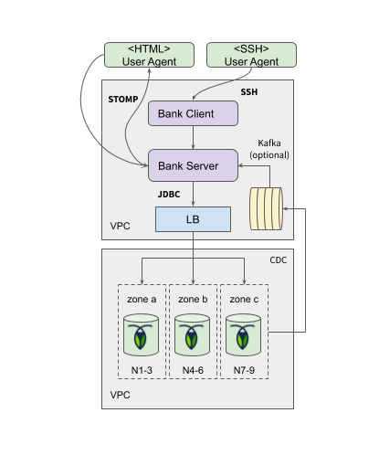
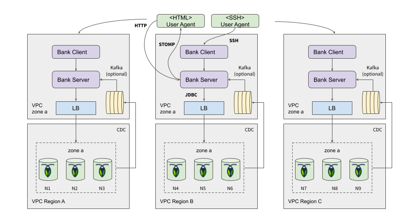

# Deployment Tutorial

Deployment tutorial for setting up a full-stack Roach Bank demo using either a 
single or multi-region topology.

## Prerequisites

- JDK8+ with 1.8 language level
- [Roachprod](https://github.com/cockroachdb/cockroach/tree/master/pkg/cmd/roachprod) - a Cockroach Labs internal
  tool for ramping AWS/GCE/Azure VM clusters 
    - You will need the AWS/GCE/AZ client SDK, and an account

## Create Cluster

First create a CockroachDB cluster with a cloud provider of choice. There are available scripts for:

- AWS
- Azure
- GCE

For example:

    cd aws
    ./aws-multiregion-eu.sh

## Demo Instructions

Once the cluster is setup and the bank is deployed, you can issue workload commands 
to create traffic.

### Starting the Client

    roachprod run $CLUSTER:10 
    ./bank-client.jar

In the client CLI, connect to localhost:

    connect

Create accounts:

    create-accounts

Transfer funds across local accounts:

    transfer

Read account balances:

    balance

### Global Workload

In a multi-region setup, it can be interesting to push traffic concurrently in
each region:

Connect to region 1:

    roachprod run cluster-name:10
    ./bank-client.jar connect
    transfer

Connect to region 2:

    roachprod run cluster-name:11
    ./bank-client.jar connect
    transfer

Connect to region 3:

    roachprod run cluster-name:12
    ./bank-client.jar connect
    transfer

Type `help` for additional guidance.

# Appendix: Deployment Diagrams

Common high-level deployment view of single-region deployments.

Common high-level deployment view of multi-region deployments.

