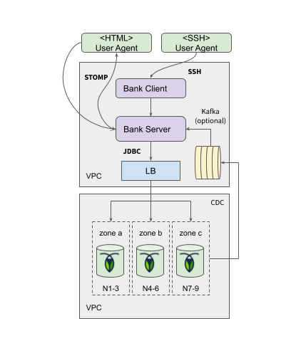

# Roach Bank Distribution

Deployment tutorial for setting up a full-stack Roach Bank demo using either a single or multi-region topology.

## Prerequisites

- JDK8+ with 1.8 language level
- [Roachprod](https://github.com/cockroachdb/cockroach/tree/master/pkg/cmd/roachprod) - a Cockroach Labs internal
  tool for ramping AWS/GCE VM clusters (you will need the AWS/GCE client SDK and an account)
  
## Scripted Setup
 
Clone, build and unpack:

    git clone git@github.com:kai-niemi/roach-bank.git
    cd roachbank
    ./mvnw clean install
    cd distribution/target
    tar xvf roach-bank.tar.gz

Run the appropriate script, for instance:

    ./aws-multiregion-eu.sh

## Manual Setup
    
Pick your poison:

- [AWS Single-Region Setup (EU)](aws-singleregion.md) - Setting up a cluster in single region in EU
- [AWS Multi-Region Setup (US-EU-APAC)](aws-multiregion-eu-us-ap.md) - Setting up a world-wide cluster spanning 3 regions (US, EU and APAC)   
- [AWS Multi-Region Setup  (US)](aws-multiregion-us.md) - Setting up a cluster spanning 3 regions in US  

## Demo Instructions

Commands to run on client VMs.

### Starting the Server

    ./roach-bank-server.jar

With custom params:

    ./roach-bank-server.jar
    --spring.datasource.hikari.maximum-pool-size=300
    --spring.datasource.url=jdbc:postgresql://localhost:26257/roach_bank?sslmode=disable
    --spring.datasource.username=root
    --spring.datasource.password=..
    --spring.flyway.enabled=true
    --spring.profiles.active=db-crdb,retry-backoff,cdc-aop
    --server.port=8090

### Starting the Client

    ./roach-bank-client.jar

Connect to localhost:

    connect

Command examples:

    help
    transfer --regions us_west
    transfer --regions us_east,eu_west --amount-range 5.00-15:00 --duration 90m
    balance --duration 15m30s --follower-reads

### Global Workload

In a multi-region setup, try to target the regions that are local to each client:

    roachprod run cluster-name:10
    ./roach-bank-client.jar connect
    transfer

Corresponding for EU:

    roachprod run cluster-name:11
    ./roach-bank-client.jar connect
    transfer

APAC:

    roachprod run cluster-name:12
    ./roach-bank-client.jar connect
    transfer

Type `help` for additional guidance.

# Appendix

Common high-level deployment view of single-region deployments.

Common high-level deployment view of multi-region deployments.

