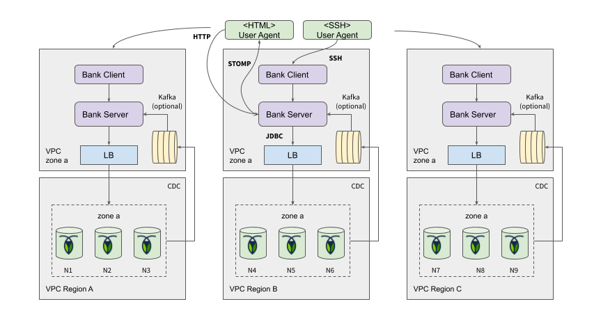

# Roach Bank Distribution

Deployment tutorial for setting up a full-stack Roach Bank demo using either a single or multi-region topology.

## Prerequisites

- JDK8+ with 1.8 language level
- [Roachprod](https://github.com/cockroachdb/cockroach/tree/master/pkg/cmd/roachprod) - a Cockroach Labs internal
  tool for ramping AWS/GCE VM clusters (you will need the AWS/GCE client SDK and an account)
  
## Scripted Setup
 
Clone, build and unpack:

    git clone git@github.com:kai-niemi/roach-bank.git
    cd roachbank
    ./mvnw clean install
    cd distribution/target
    tar xvf roach-bank.tar.gz

Run the appropriate script, for instance:

    ./multiregion-aws-eu.sh

See separate [README](src/README.md) for how to start the server and client if needed.

## Manual Setup

Pick your poison:

- [Single-Region Setup (EU)](singleregion-aws.md) - Setting up a cluster in single region in EU
- [Multi-Region Setup (US-EU-APAC)](multiregion-aws-eu-us-ap.md) - Setting up a world-wide cluster spanning 3 regions (US, EU and APAC)   
- [Multi-Region Setup  (US)](multiregion-aws-us.md) - Setting up a cluster spanning 3 regions in US  

## Appendix

Common high-level deployment view of single-region deployments.

Common high-level deployment view of multi-region deployments.

