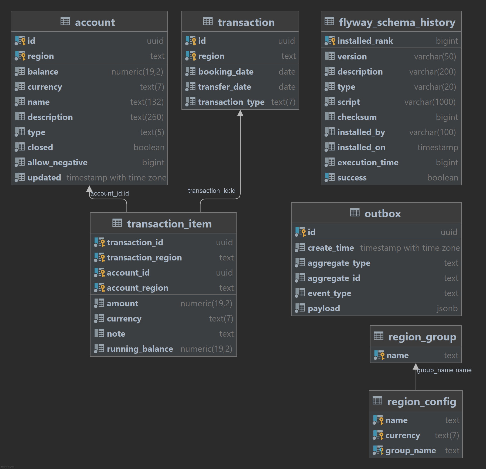

# Design Notes

Roach Bank is based on a typical lightweight, self-contained and stateless Spring Boot application architecture. 
It provides two distinct data access implementations; JPA via Hibernate and plain JDBC, both included in a single
self-contained executable JAR artifact with an embedded Jetty servlet container. 

Key architectural mechanisms and realizations:

- Persistence
   - RDBMS 
       - CockroachDB
       - PostgresSQL
-  Data Access
    - ORM
       - Hibernate via Spring Data JPA
    - Plain JDBC via Spring Data JDBC
    - Pagination (limit/offset based)
    - Schema Versioning
        - Flyway
- Transaction Management
    - Local transactions only (no JTA/XA transactions)
    - Serializable isolation (SSI in PSQL)
- Interoperability
    - Hypermedia API
        - Spring MVC, Spring Hateoas using HAL+json
    - Websocket push 
        - Streaming text oriented mesaging protocol (STOMP)
    - Kafka consumer/publisher of CDC events 
- Frontend / UX
    - Web UI
        - Thymeleaf template framework, CSS and JQuery
        - Bootstrap    
- Auditing/Logging/Monitoring
    - SLF4J + Logback via Spring                   
    - Spring Boot Actuators
    - TTDDYY DSProxy
- Caching
    - HTTP client side
    - Spring Cache for reporting (local)
- Resource Management
    - Connection pooling
        - HikariCP 
- Scheduling
    - Spring built-in cron task scheduling (non-clustered)
- Inversion of Control       
    - Spring Boot for IOC and self-contained deployable
    - AOP aspects for retryable transactions and hints
- Load Balancing
    - HAProxy (any TCP based works)
- Platform and Build
    - JDK 8 language level (OpenJDK compatible)
    - Maven 3+

## Entity Model

The system uses the following entity model for double-entry bookkeeping of monetary transaction history. 



- **account**  - Accounts with a derived balance from the sum of all transactions
- **transaction**  - Balanced multi-legged monetary transactions
- **transaction_item** - Association table between transaction and account representing a leg with a running account balance.
- **region**  - Static information about deployment regions
- **city**  - Static information about deployment cities and currencies

### Main SQL files

Flyway is used to setup the DB schema and account plan during startup time. The schema is not geo-partitioned 
by default.

- [SQL files](../bank-server/src/main/resources/db) 

## Transaction Workflow (default)

Each monetary transaction creates a transaction record (1) and one leg (2) for each account update, and 
also updates the cached balance on each account (3). A CHECK constraint ensures that balances 
don't end up negative, unless allowed for that account (using `allow_negative` column). 

The `UPDATE .. FROM` with array unnesting is a workaround for the lack of batch update's over the wire.
PG-JDBC doesn't actually batch UPDATE statements, only INSERTs with rewrites.

In this workflow, the initial balance check on the accounts is redundant since the invariant check
is performed by looking at the rows affected on the final UPDATE. An UPDATE also takes an implicit lock  
in the read part in CockroachDB (configurable) which will reduce retries.

```sql
-- (1) header
INSERT INTO transaction (id,city,balance,currency,name,..);
-- (2) for each leg (batch)
INSERT INTO transaction_item (city,transaction_id,..);
-- (3) for each account (batch)
UPDATE account SET balance = account.balance + data_table.balance, updated_at=clock_timestamp()
FROM (select unnest(?) as id, unnest(?) as balance) as data_table
WHERE account.id=data_table.id
  AND account.closed=false
  AND (account.balance + data_table.balance) * abs(account.allow_negative-1) >= 0
```

The CHECK constraints:

````sql
alter table account
    add constraint check_account_allow_negative check (allow_negative between 0 and 1);
alter table account
    add constraint check_account_positive_balance check (balance * abs(allow_negative - 1) >= 0);
````

## Transaction Workflow (alternative) 
                            
The alternative worklflow will perform an initial balance check and optionally use select-for-update locks.
The benefit here is that the running balance of the accounts can be stored on the transaction legs. 
Other than that, the end result is the same.

The atlternative workflow exist only to force more contention and retries for observation.

```sql
-- (1) initial query for all involved accounts (lock is optional)
SELECT .. FROM account WHERE id IN (..) AND city IN (..) /* FOR UPDATE */;
-- (2) header 
INSERT INTO transaction (id,city,balance,currency,name,..);
-- (3) for each leg (notice running_balance)
INSERT INTO transaction_item (city,transaction_id,running_balance,..);
-- (4) for each account (batch)
UPDATE account SET balance = account.balance + data_table.balance, updated_at=clock_timestamp()
FROM (select unnest(?) as id, unnest(?) as balance) as data_table
WHERE account.id=data_table.id
  AND account.closed=false
  AND (account.balance + data_table.balance) * abs(account.allow_negative-1) >= 0
```

### Transaction Retry Strategy

Any database running in serializable is exposed to transient retry errors on contended workloads. 
These errors are detected and handled via Spring/CGLIB proxies with an exponential backoff. 
