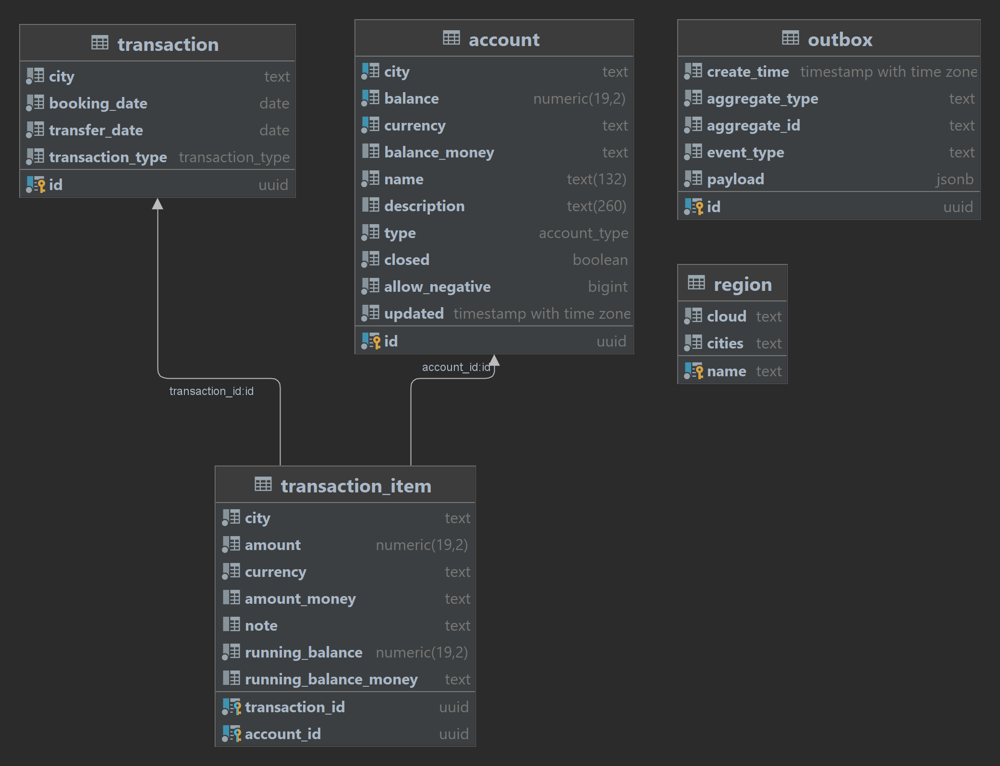

# Design Notes

Roach Bank is based on a typical lightweight, self-contained and stateless Spring Boot application architecture. 
It provides two distinct server implementations; JPA via Hibernate and plain JDBC, both included in a single
self-contained executable JAR artifact with an embedded Jetty servlet container. 

Key architectural mechanisms and realizations:

- Persistence
   - RDBMS 
       - CockroachDB
       - PostgresSQL
-  Data Access
    - ORM
       - Hibernate via Spring Data JPA
    - Plain JDBC via Spring Data JDBC
    - Pagination (limit/offset based)
    - Schema Versioning
        - Flyway
- Transaction Management
    - Local transactions only (no JTA/XA transactions)
    - Serializable isolation (SSI in PSQL)
- Interoperability
    - Hypermedia API
        - Spring MVC, Spring Hateoas using HAL+json
    - Websocket push 
        - Streaming text oriented mesaging protocol (STOMP)
    - Kafka consumer/publisher of CDC events 
- Frontend / UX
    - Web UI
        - Thymeleaf template framework, CSS and JQuery
        - Bootstrap    
- Auditing/Logging/Monitoring
    - SLF4J + Logback via Spring                   
    - Spring Boot Actuators
    - TTDDYY DSProxy
- Caching
    - HTTP client side
    - Spring Cache for reporting (local)
- Resource Management
    - Connection pooling
        - HikariCP 
- Scheduling
    - Spring built-in cron task scheduling (non-clustered)
- Inversion of Control       
    - Spring Boot for IOC and self-contained deployable
    - AOP aspects for retryable transactions and hints
- Load Balancing
    - HAProxy (any TCP based works)
- Platform and Build
    - JDK 8 language level (OpenJDK compatible)
    - Maven 3+

## Entity Model

The system uses the following entity model for double-entry bookkeeping of monetary transaction history. 

- **account**  - Accounts with a derived balance from the sum of all transactions
- **transaction**  - Balanced multi-legged monetary transactions
- **transaction_item** - Association table between transaction and account representing a leg with a running account balance.
- **region_map**  - Static information about deployment regions and currencies

### Main SQL files

Flyway is used to setup the DB schema and account plan during startup time. The schema is not geo-partitioned 
by default.

- [SQL files](../bank-server/src/main/resources/db) 

## Transaction Workflow

Each monetary transaction first reads the current balance of the accounts involved using pessimistic locks (1), 
then creates a transaction (2) with legs (3) for each account update, and finally updates the balance on each 
account (4). As an extra safety guarantee, a schema CHECK constraint will ensure balances don't end up negative, 
unless allowed for that account.

    (1) SELECT .. FROM account WHERE id IN (..) AND city IN (..) FOR UPDATE;
    
    (2) INSERT INTO transaction (id,city,balance,currency,name,..);
    
    -- for each leg (batch)
    (3) INSERT INTO transaction_item (transaction_city,transaction_id,..);
    
    -- for each account (batch)
    (4) UPDATE account SET balance=balance+? WHERE id=? AND city=? AND (balance+?)*abs(allow_negative-1)>=0;

### Transaction Retry Strategy

Any database running in serializable is exposed to transient retry errors. These errors are detected
and handled via Spring/CGLIB proxies with exponential backoff. 
